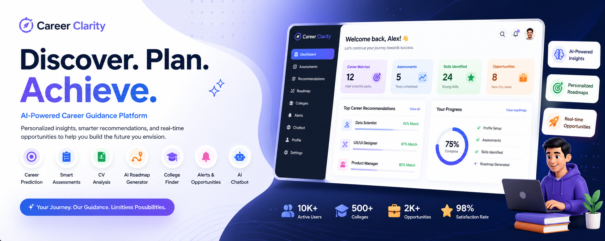
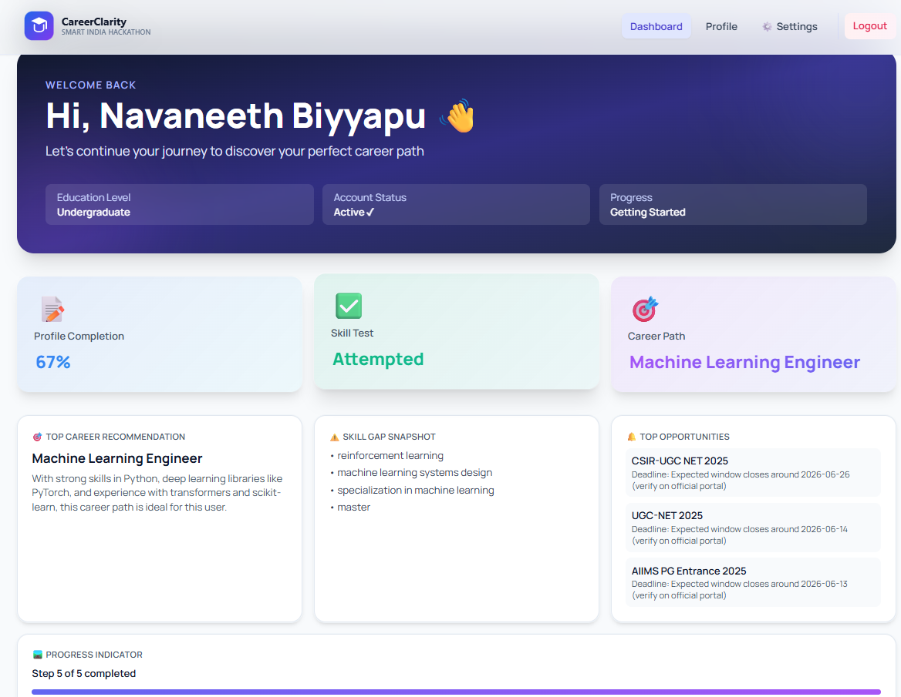

# 🚀 Career Clarity

  

  <b>AI-Powered Career Guidance Platform</b> 
  Helping students discover, plan, and achieve their ideal career path

---

## 🌐 Live Demo

👉 https://career-clarity-three.vercel.app/

---

## 🧠 Overview

Career Clarity is a full-stack AI-powered platform that helps users make smarter career decisions based on their skills, interests, and abilities. It provides personalized recommendations, structured roadmaps, and real-time opportunities to guide users from exploration to achievement.

---

## ✨ Core Features

- 🎯 Personalized Career Recommendations  
- 📝 Smart Assessment System (Quick + Skill Tests)  
- 📄 CV Analysis & Skill Gap Detection  
- 🧭 AI-Generated Career Roadmaps  
- 🏫 College Finder with Smart Ranking  
- 🔔 Alerts for Internships, Jobs, and Scholarships  
- 🤖 AI Chatbot for Career Guidance  
- ⚙️ User Settings & Customization  

---

## 🖼️ UI Preview

### 🏠 Homepage

  

---

### 📊 Dashboard

  

---

### 🎯 Recommendations

  

---

### 🔔 Alerts

  

---

## 🛠️ Tech Stack

**Frontend**
- React 18  
- Vite  
- Tailwind CSS  
- Axios  

**Backend**
- Django  
- Django REST Framework  
- JWT Authentication  

**Database**
- PostgreSQL (Production)  
- SQLite (Development)  

---

## ⚙️ Installation

### Frontend

- cd career-clarity-main
- npm install
- npm run dev

---

### Backend
- cd career-clarity-backend
- pip install -r requirements.txt
- python manage.py migrate
- python manage.py runserver

---

## 🚀 Deployment

- Frontend → Vercel  
- Backend → Render  
- Database → Render PostgreSQL  

---

## 🧪 Usage

1. Register / Login  
2. Complete Profile  
3. Upload CV  
4. Take Tests  
5. View Recommendations  
6. Explore Roadmap  
7. Check Alerts  

---

## 📌 Status

🟢 Active Development  
🚀 Production Ready  
